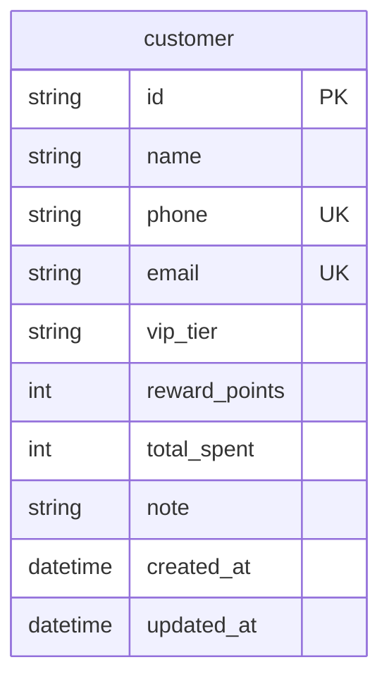

# Customers — Data Model

Persistence design for member-catalog endpoints. Table: `customer`. Response DTO maps snake_case DB → camelCase JSON to match FE / OpenAPI `Customer`.

## ER sketch



**Primary key is `id`** (same as `product.id`). Future checkout / preorder tables FK to `customer.id` (`customer_id` nullable, **`ON DELETE SET NULL`**) and store **required** `customerName` / `customerPhone` snapshots. They are **not** created in this phase.

---

## Table: `customer`

Member profile. **Primary key: `id`.** **Does not** store `vip_tier_name` (derived on read). **Does** store `total_spent` and `reward_points` as running balances.

| Column | Type (suggested) | Constraints / notes |
|--------|------------------|---------------------|
| `id` | `VARCHAR` / `String` PK | Opaque `cust-{uuid4}` without dashes; seed may use `cust-001` style |
| `name` | `String` | Required |
| `phone` | `String` | **UNIQUE**, required; canonical digits (see phone normalize) |
| `email` | `String` | **UNIQUE**, required; trim + lowercase; valid email format |
| `vip_tier` | `String` | `regular` \| `silver` \| `gold` \| `platinum` → JSON `vipTier`; **default `regular`** on insert if omitted |
| `reward_points` | `Integer` | ≥ 0; default `0` → `rewardPoints`. PUT replaces; POST add increments; never store negative |
| `total_spent` | `Integer` | TWD ≥ 0; default `0` → `totalSpent`; catalog create always `0`; catalog PUT must not change |
| `note` | `Text` / `String` nullable | |
| `created_at` | `DateTime` TZ | Server set on insert → JSON `createdAt` (ISO 8601) |
| `updated_at` | `DateTime` TZ | Server set on insert/update; **not** in FE `Customer` response |

### Indexes / uniqueness

| Index | Columns | Unique? | Purpose |
|-------|---------|---------|---------|
| PK | `id` | yes | Member identity; path param `{customerId}` |
| UK | `phone` | yes | Duplicate phone → API conflict; exact `getCustomerByPhone` |
| UK | `email` | yes | Duplicate email → API conflict; keyword search |
| IX | `name` | no (optional) | Name filter / default list sort `name ASC` |
| IX | `vip_tier` | no (optional) | VIP search filter |
| IX | `reward_points` | no (optional) | `minPoints` search filter |

**Confirmed:** `id` is the **only** primary key — server-assigned `cust-{uuid4}`; never an auto-increment integer. Same naming as `product.id`.  
**Confirmed:** `phone` **is** unique — one member per canonical number; `getCustomerByPhone` returns a single row.  
**Confirmed:** `email` **is** unique and **required** — one member per lowercased address; missing / invalid format is rejected before uniqueness.

---

## Phone canonicalize (stored in `phone`)

Same spirit as product `normalizeSku`, but for MSISDN / local mobile strings.

```text
input → trim → remove spaces, hyphens, parentheses
```

Examples:

| Input | Stored `phone` |
|-------|----------------|
| `0912345678` | `0912345678` |
| `0912-345-678` | `0912345678` |
| ` 0912 345 678 ` | `0912345678` |
| `(09)12345678` | `0912345678` |

Do **not** strip a leading `+` **and** country digits in this phase (no E.164 conversion). If a value still contains `+`, keep `+` plus remaining digits (`+886912345678`). After canonicalize, `phone` must be non-empty.

Uniqueness and `GET /customers/by-phone/{phone}` both use this canonical form.

---

## Email normalize

Always applied on create / update when `email` is set:

```text
input → trim → lowercase
```

Then validate as an email (Pydantic `EmailStr` / equivalent). After normalize:

- Empty → **invalid** (`422`); email is never optional and never `NULL`.
- Malformed (no `@`, invalid local/domain) → `422`.
- Unique on the stored lowercased value (`A@B.com` and `a@b.com` collide).

Examples:

| Input | Stored `email` |
|-------|----------------|
| `User@Example.COM` | `user@example.com` |
| `  kuanyu.chen@example.com ` | `kuanyu.chen@example.com` |
| `` (empty) | rejected `422` |
| `not-an-email` | rejected `422` |

---

## Server-computed / server-owned response fields

| API field | Computation / ownership |
|-----------|-------------------------|
| `id` | Assigned on insert (`cust-{uuid4}` no dashes); never trust client |
| `createdAt` | `customer.created_at` ISO 8601; never trust client |
| `vipTierName` | **Not stored.** Map from `vip_tier` (白金黑卡 (9折) / 金卡會員 (95折) / 銀卡會員 (98折) / 一般會員) |
| `totalSpent` | Stored `total_spent`; catalog create writes `0`; catalog update must not accept; checkout later increments |
| `rewardPoints` | Stored `reward_points`; create/PUT **set**; `POST .../reward-points` **adds**; checkout later increments/decrements |
| `phone` | Stored canonical; always derived on write from client input |
| `email` | Stored lowercased; always derived on write from client input; unique |

`updated_at` is persistence-only (audit), not part of the FE `Customer` JSON.

---

## ORM / module map (planned, not implemented)

| Piece | Path |
|-------|------|
| Models | `src/models/customer.py` |
| Schemas | `src/schemas/customer.py` |
| Service | `src/services/customer_service.py` |
| Endpoints | `src/api/v1/endpoints/customers.py` |
| Router | `src/api/v1/api.py` |
| Migration | `alembic/versions/…` |

Register models in `src/models/__init__.py` / `src/db/base.py` so Alembic autogenerate sees them.

---

## Alembic notes

1. First revision: **schema only** — `customer` table + indexes/constraints above (no seed data).
2. Prefer explicit PK on `id` plus unique constraints on `phone` **and** `email` in migration (not only ORM).
3. **Seed later (decision B):** Alembic data migration and/or management script — insert `customer` rows with seed-style `cust-001` ids OK. See [`04-open-questions.md`](./04-open-questions.md).
4. `created_at` / `updated_at`: use timezone-aware UTC; update `updated_at` in service on profile PUT and on add-points.
5. Do **not** add FKs from checkout/preorder in this migration (those tables do not exist yet).
6. **Hard delete:** `DELETE` removes the `customer` row. No `deleted_at` / discontinued flag. Later modules: block delete when any related order/preorder is unfinished (not `completed`/`refunded`/`cancelled`); terminal rows use **`ON DELETE SET NULL`** on `customer_id` and **must keep** name/phone snapshots. This migration does not add those FKs.

---

## Mapping cheatsheet (DB → JSON)

| DB | JSON |
|----|------|
| `id` | `id` |
| `vip_tier` | `vipTier` |
| (computed from `vip_tier`) | `vipTierName` |
| `reward_points` | `rewardPoints` |
| `total_spent` | `totalSpent` |
| `created_at` | `createdAt` |
| `updated_at` | *(not in API)* |
