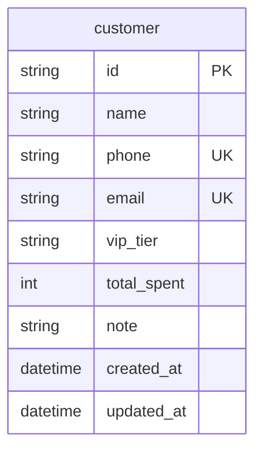

# Customers — Data Model

Table: `customer`. Snake_case DB → camelCase JSON.

## ER sketch



**Primary key is `id`.** Future checkout / preorder FKs: `customer_id` nullable, **`ON DELETE SET NULL`**, plus name/phone snapshots. Those tables are **not** created here.

---

## Table: `customer`

No `vip_tier_name` (derived). No `reward_points`.

| Column | Type (suggested) | Constraints / notes |
|--------|------------------|---------------------|
| `id` | `String` PK | `cust-{uuid4}` without dashes |
| `name` | `String` | Required |
| `phone` | `String` nullable | **UNIQUE** among non-null; canonical when set |
| `email` | `String` nullable | **UNIQUE** among non-null; trim + lowercase when set |
| `vip_tier` | `String` | default `regular` |
| `total_spent` | `Integer` | default `0`; catalog PUT must not change |
| `note` | `Text` / `String` | Optional **string**. Omit or `""`. JSON type is `string`, not `nullable` |
| `created_at` | `DateTime` TZ | JSON `createdAt` |
| `updated_at` | `DateTime` TZ | JSON `updatedAt`; bump on profile update |

### Indexes / uniqueness

| Index | Columns | Unique? | Purpose |
|-------|---------|---------|---------|
| PK | `id` | yes | `{customerId}` |
| UK | `phone` | yes | Duplicate **non-null** phone. Multiple `NULL` phones allowed |
| UK | `email` | yes | Duplicate **non-null** email. Multiple `NULL` emails allowed |
| IX | `name` | no | Keyword / sort `name ASC` |
| IX | `vip_tier` | no | VIP search filter |

---

## Phone canonicalize

```text
input → trim → remove spaces, hyphens, parentheses
```

Keep a leading `+` if present (no E.164 conversion). After canonicalize, empty → store SQL `NULL` (JSON `null`). Non-empty stored form is unique among non-null rows.

Keyword search uses this stored form (substring, also `canonicalize(query)`). Null phones never match the phone keyword branch.

| Input | Stored `phone` |
|-------|----------------|
| omit / `null` / `""` / `   ` / `---` | `NULL` |
| `0912-345-678` | `0912345678` |

---

## Email normalize

When `email` is sent and not `null`:

```text
input → trim → lowercase
```

Then:

- Omit, JSON `null`, or whitespace-only → store SQL `NULL` (JSON `null`).
- Malformed → `422`.
- Unique on stored lowercased non-null values only.

| Input | Stored `email` |
|-------|----------------|
| `User@Example.COM` | `user@example.com` |
| omit / `null` / `""` / `   ` | `NULL` |
| `not-an-email` | rejected `422` |

---

## `note`

JSON type is **`string`**, optional (not in `required`). Do **not** mark OpenAPI `nullable: true`. Clients omit the field or send `""`. Persistence may use SQL `NULL` when omitted; that is storage, not the API type.

---

## Server-owned response fields

| API field | Ownership |
|-----------|-----------|
| `id` | Assigned on insert |
| `createdAt` | `created_at` ISO 8601 |
| `updatedAt` | `updated_at` ISO 8601; set on insert and profile PUT |
| `vipTierName` | Map from `vip_tier` |
| `totalSpent` | Stored; create `0`; PUT must not accept |
| `phone` | Canonical on write, or `null` |
| `email` | Lowercased on write, or `null` |

---

## Alembic notes

1. Schema only — no seed. Existing `customer` table (if already migrated) needs a **follow-up revision**: drop `reward_points`; make `phone` and `email` nullable.
2. Unique `phone` allowing multiple `NULL`; unique `email` allowing multiple `NULL`.
3. `created_at` / `updated_at` timezone-aware UTC; bump `updated_at` on PUT.
4. No checkout/preorder FKs in this table.

## Mapping cheatsheet

| DB | JSON |
|----|------|
| `id` | `id` |
| `vip_tier` | `vipTier` |
| (from `vip_tier`) | `vipTierName` |
| `total_spent` | `totalSpent` |
| `created_at` | `createdAt` |
| `updated_at` | `updatedAt` |
| `phone` | `phone` (`null` when SQL `NULL`) |
| `email` | `email` (`null` when SQL `NULL`) |
| `note` | `note` |
